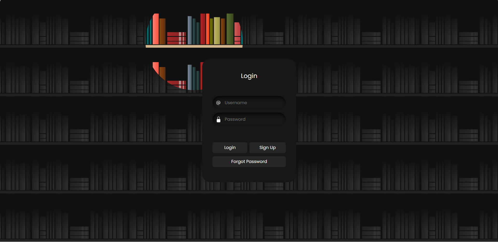

# Hệ thống quản lý đồ án tốt nghiệp
## 1. Giới thiệu

Nền tảng giúp kết nối sinh viên và giảng viên, tối ưu hóa mọi bước trong quá trình hoàn thành đồ án tốt nghiệp.
Hệ thống được xây dựng nhằm hỗ trợ công tác quản lý, theo dõi và đánh giá hoạt động của sinh viên trong suốt quá trình làm đồ án. Thay vì quản lý thủ công, hệ thống mang đến một giải pháp tập trung, hiện đại và dễ sử dụng.

## 2. Các công nghệ được sử dụng

**Hệ điều hành**
<br>


**Công nghệ chính**
<br>


**Web Server & Database**
<br>


## 3. Hình ảnh các chức năng

### Trang đăng nhập


### Trang dashboard admin


### Trang dashboard giảng viên


### Trang dashboard sinh viên


## 4. Hướng dẫn cài đặt

#### 4.1. Cài đặt công cụ

* Tải và cài đặt XAMPP
* Tải XAMPP tại: [https://www.apachefriends.org/download.html](https://www.apachefriends.org/download.html)
* Cài đặt Visual Studio Code và các extension:
    * PHP Intelephense
    * MySQL
    * Prettier - Code Formatter

### 4.2. Tải project (Clone)

Mở Terminal (dòng lệnh), di chuyển đến thư mục `htdocs` của XAMPP và chạy lệnh sau:

```bash
# Di chuyển vào thư mục htdocs (thay C:\ bằng ổ đĩa của bạn nếu khác)
cd C:\xampp\htdocs

# Clone dự án từ GitHub
git clone https://github.com/nongducanhh/quan-ly-showroom-oto
```

### 4.3. Cài đặt Database

Mở XAMPP Control Panel, khởi động Apache và MySQL.

Truy cập MySQL Workbench Tạo Database:
```bash
CREATE DATABASE IF NOT EXISTS quanlyshowroomoto
CHARACTER SET utf8mb4
COLLATE utf8mb4_unicode_ci;
```

### 4.4. Setup tham số kết nối

Mở file db_connection.php trong project, chỉnh thông tin DB:

```bash
<?php
$servername = "localhost";
$username = "root";
$password = "123456"; // Để trống nếu bạn dùng XAMPP mặc định
$dbname = "qlsro";

$conn = new mysqli($servername, $username, $password, $dbname);
if ($conn->connect_error) {
  die("Kết nối thất bại: " . $conn->connect_error);
}
?>
```

### 4.5. Chạy hệ thống

Mở XMAPP Control Panel -> Start Apache và MySQL

Truy cập hệ thống: http://localhost/baitaplonmont5/baibaocao/index.php

## 5. Đăng nhập lần đầu

Hệ thống có sẵn tài khoản quản trị viên (Admin) để bạn đăng nhập và cấu hình ban đầu:

* **Username:** `admin`
* **Password:** `123`
